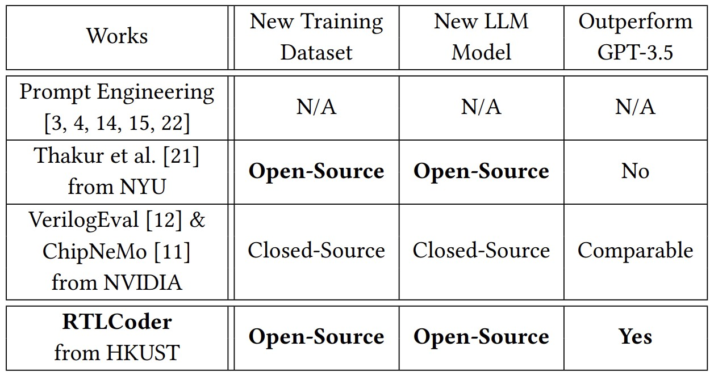

```
  ___    _____   _        ____               _               
 |  _ \  |_   _| | |      / ___|   ___     __| |   ___   _ __ 
 | |_) |   | |   | |     | |      / _ \   / _` |  / _ \ | '__|
 |  _ <    | |   | |___  | |___  | (_) | | (_| | |  __/ | |   
 |_| \_\   |_|   |_____|  \____|  \___/   \__,_|  \___| |_|                                           
```
<p align="left">
    <a href="#-Papers">Papers</a>
    | <a href="#-Repo-intro">Repo-intro</a>
    | <a href="#-RTLCoder-flow">RTLCoder-flow</a>
    | <a href="#-Dataset">Dataset-generation</a>
    | <a href="#-Benchmarking">Model-inference</a>
    | <a href="#-Model-training">Model-training</a>
</p>

## 📄 Papers

This is the official implementation for RTLCoder. We have three relevant accepted papers: 

**OpenLLM-RTL: Open Dataset and Benchmark for LLM-Aided Design RTL Generation** (Invited).[[paper]](https://zhiyaoxie.com/files/ICCAD24_OpenLLM.pdf) IEEE/ACM International Conference on Computer-Aided Design (ICCAD), 2024. 

**RTLCoder: Fully Open-Source and Efficient LLM-Assisted RTL Code Generation Technique**.[[paper]](https://zhiyaoxie.github.io/files/TCAD25_RTLCoder.pdf) IEEE Transactions on Computer-Aided Design of Integrated Circuits and Systems.

**RTLCoder: Outperforming GPT-3.5 in Design RTL Generation with Our Open-Source Dataset and Lightweight Solution**.[[paper]](https://zhiyaoxie.com/files/LAD24_RTLCoder.pdf) International Symposium on LLM-Aided Design, 2024 (Best Paper Nomination).


## 📚 Repo-intro

_**Note**: The model, dataset, inference scripts, data generation flow and training flow are provided._

_**Important**: If you want to test **RTLCoder-Deepseek**, please check our comments within the **benchmark_inference/test_on_verilog-eval.py** file. They are the response postprocessing method designed for **RTLCoder-Deepseek**. The default inference script is for **RTLCoder-Mistral**._


Targeting Verilog code generation, we propose an automated flow to generate a large labeled dataset with diverse Verilog design problems and answers. It addresses the serious data availability challenge in IC design-related tasks, and its potential applications are not limited to LLMs. The
LLM directly trained on it can already achieve comparable accuracy with GPT-3.5.

We also introduce a new LLM training scheme based on code quality feedback. It further boosts the ultimate model performance to outperform GPT-3.5. And we further revised the training process from an algorithm perspective to reduce its GPU memory consumption.


TABLE 1 summarizes existing works in LLM-based design RTL generation.



TABLE 1: LLM-based works on design RTL generation (e.g., Verilog). 

**In our work, we provide four RTL code generation models that are available on the HuggingFace platform.**

1. [RTLCoder-Deepseek-v1.1](https://huggingface.co/ishorn5/RTLCoder-Deepseek-v1.1).
   This model was finetund on DeepSeek-coder-6.7b. It has the best performance on VerilogEval and RTLLM benchmarks but with a relatively lower inference speed compared with the following models. The       RTLCoder-Deepseek-v1.1 may not stop even when the required output text is finished. So We need to extract the required code part before the keyword"endmodulemodule" from the output sequence and add an "endmodule" at the end.
3. [RTLCoder-v1.1](https://huggingface.co/ishorn5/RTLCoder-v1.1). (Finetuned based on Mistral-v0.1)
4. [RTLCoder-v1.1-gptq-4bit](https://huggingface.co/ishorn5/RTLCoder-v1.1-gptq-4bit). (The GPTQ version of RTLCoder-v1.1)
5. [RTLCoder-v1.1-gguf-4bit](https://huggingface.co/ishorn5/RTLCoder-v1.1-gguf-4bit). This quantized one could run on CPU. (The CPU version of RTLCoder-v1.1)


## 🔄 RTLCoder-flow

In this paper, there are two main contributions to obtain the RTLCoder. 
(1) We first introduce our automated dataset generation flow. It generated our RTL generation dataset with over 27 thousand samples, each sample being a pair of design description instruction and corresponding reference code. We build this automated generation flow by taking full advantage
of the powerful general text generation ability of the commercial tool GPT. Please notice that GPT is only used for dataset generation in this work and we adhere to the terms of service of OpenAI, and there is no commercial competition between the proposed RTLcoder and OpenAI's models. The automated dataset generation flow is illustrated in **Figure 1** which includes three stages: 1) RTL domain keywords preparation, 2) instruction generation, and 3) reference code generation. We designed several general prompt templates to control GPT generating the desired outputs in each stage.


   

   Figure 1:  Our proposed automated dataset generation flow.

(2) Besides the new training dataset, we propose a new LLM training scheme that incorporates code quality scoring. It significantly improves the RTLCoder’s performance on the RTL generation task. Also, we revised the training process from the algorithm perspective to reduce the GPU memory consumption of this new training method, allowing implementation with limited hardware resources. The training scheme is illustrated in **Figure 2**.


   

   Figure 2:  Our proposed training scheme based on RTL quality score.


## 📊 Dataset

We provide the generation scripts and data samples in the folder **"data_generation"**. You can design your own prompting method by modifying the file **"p_example.txt"** and **"instruction_gen.py"**.

You can expand the existing dataset by running the following command.
```
python instruction_gen.py
```
The 27K instruction-code dataset "Resyn-27k.json" is provided in the "dataset" file. Please kindly note that the dataset was generated by GPT-3.5-turbo and it cannot be guaranteed that all the data are strictly correct. Despite the possible presence of errors in some problem descriptions and design code, we believe that they can still provide valuable information for model training.

## 🧪 Benchmarking

(1) Inference demo

The input prompt may have a great influence on the generation quality. Ideally, it should describe the circuit "IO" and behavior clearly so that it doesn't contain ambiguity. We provide a template as follows.
```
Please act as a professional verilog designer.

Implement a data width conversion circuit that converts 8-bit data input to 16-bit data output. The module provides two output ports: valid_out, which indicates the validity of the output data, and data_out, which represents the converted 16-bit output data. The first arriving 8-bit data should be placed in the higher 8 bits of the 16-bit data output. The valid_out and data_out signals are generated in the next clock cycle after the two data inputs. When there is only one data input, valid_out and data_out are not generated immediately. Instead, they wait for the arrival of the next data input to complete the concatenation of the two data inputs before generating valid_out and data_out. 

Module name:  
    width_8to16   

Input ports:
    clk: Clock signal used for synchronous operation.
    rst_n: Active-low reset signal. Defined as 0 for reset and 1 for reset signal inactive.
    valid_in: Input signal indicating the validity of the input data.
    data_in: 8-bit input data to be converted.

Output ports:
    valid_out: Output signal indicating the validity of the output data.
    data_out: 16-bit output data resulting from the width conversion.
Implementation:
The data_out register is triggered on the positive edge of the clock signal (posedge clk) or the negative edge of the reset signal (negedge rst_n).
On reset, indicated by !rst_n, the data_out register is cleared to 0.
If the input data is valid (valid_in) and the flag signal is active, the data_out register is updated by concatenating the contents of the data_lock register (8 bits) and the data_in register (8 bits) to form a 16-bit output. The first valid data is temporarily stored, and when the second valid data is inputted, they are concatenated to produce the output valid_out and data_out.

Give me the complete code.


module width_8to16(
	input 				   clk 		,   
	input 				   rst_n		,
	input				      valid_in	,
	input	   [7:0]		   data_in	,
 
 	output	reg			valid_out,
	output   reg [15:0]	data_out
);


```

If you don't have a GPU with more than 4 GB memory, please try the quantized 4-bit version which could run on CPU: [RTLCoder-v1.1-gguf-4bit](https://huggingface.co/ishorn5/RTLCoder-v1.1-gguf-4bit). Before you try the following code, please install the [ctransformers](https://github.com/marella/ctransformers) package.

```

from ctransformers import AutoModelForCausalLM
model_path = 'ggml-model-q4_0.gguf'
# Set gpu_layers to the number of layers to offload to GPU. Set to 0 if no GPU acceleration is available on your system.
llm = AutoModelForCausalLM.from_pretrained(model_path, model_type="mistral", gpu_layers=0, max_new_tokens=2000, context_length=6048, temperature=0.5, top_p=0.95,)
prompt = "Please act as a professional verilog designer and provide a half adder. \nmodule half_adder\n(input a, \ninput b, \noutput sum, \n output carry);\n"
print(llm(prompt))

```
For inference using RTLCoder, you can just use the following code.
```
import torch
from transformers import AutoTokenizer, AutoModelForCausalLM
# Prompt
prompt = "Please act as a professional verilog designer and provide a half adder. \nmodule half_adder\n(input a, \ninput b, \noutput sum, \n output carry);\n"

# Load model and tokenizer
# With multiple gpus, you can specify the GPU you want to use as gpu_name (e.g. int(0)).
gpu_name = 0
tokenizer = AutoTokenizer.from_pretrained("ishorn5/RTLCoder-Deepseek-v1.1")
model = AutoModelForCausalLM.from_pretrained("ishorn5/RTLCoder-Deepseek-v1.1", torch_dtype=torch.float16, device_map=gpu_name)
model.eval()
# Sample
input_ids = tokenizer(prompt, return_tensors="pt").input_ids.to(gpu_name)
sample = model.generate(input_ids, max_length=512, temperature=0.5, top_p=0.9)
s_full = tokenizer.decode(sample[0])
# The RTLCoder-Deepseek-v1.1 may not stop even when the required output text is finished.
# We need to extract the required part from the output sequence based on a keyword "endmodulemodule".
if len(s_full.split('endmodulemodule', 1)) == 2:
    s = s_full.split('endmodulemodule', 1)[0] + "\n" + "endmodule"
else:
    s = s_full.rsplit('endmodule', 1)[0] + "\n" + "endmodule"
if s.find('top_module') != -1:
    s = s.split('top_module', 1)[0]
    s = s.rsplit('endmodule', 1)[0] + "\n" + "endmodule"
index = s.rfind('tb_module')
if index == -1:
    index = s.find('testbench')
if index != -1:
    s_tmp = s[:index]
    s = s_tmp.rsplit("endmodule", 1)[0] + "\n" + "endmodule"
print(s)

#For "ishorn5/RTLCoder-v1.1", it will stop generating tokens after completing the coding task.
#But you can still use the keyword "endmodule" to extract the code part.
#tokenizer = AutoTokenizer.from_pretrained("ishorn5/RTLCoder-v1.1")
#model = AutoModelForCausalLM.from_pretrained("ishorn5/RTLCoder-v1.1", torch_dtype=torch.float16, device_map=gpu_name)
#model.eval()
#Sample
#input_ids = tokenizer(prompt, return_tensors="pt").input_ids.to(gpu_name)
#sample = model.generate(input_ids, max_length=512, temperature=0.5, top_p=0.9)
#print(tokenizer.decode(sample[0]))
```
To test the RTLCoder-gptq-4bit,  you can just use the following code. Before you try the following code, please make sure to have the package [https://github.com/marella/ctransformers](https://github.com/AutoGPTQ/AutoGPTQ).
```
from transformers import AutoTokenizer
from [auto_gptq](https://github.com/marella/ctransformers) import AutoGPTQForCausalLM, BaseQuantizeConfig
# Prompt
prompt = "Please act as a professional verilog designer and provide a half adder. \nmodule half_adder\n(input a, \ninput b, \noutput sum, \n output carry);\n"

tokenizer = AutoTokenizer.from_pretrained("ishorn5/RTLCoder-v1.1-gptq-4bit", use_fast=True)
model = AutoGPTQForCausalLM.from_quantized("ishorn5/RTLCoder-v1.1-gptq-4bit", device="cuda:0")
model.eval()
# Sample
inputs = tokenizer(prompt, return_tensors="pt").to(0)
sample = model.generate(**inputs, max_length=512, temperature=0.5, top_p=0.9)
print(tokenizer.decode(sample[0]))
```

(2) Test model on Verilog-eval

We provide the inference script **"test_on_verilog-eval.py"** for "verilog-eval" benchmark in folder **"benchmark_inference"**. 
You need to firstly download the "verilog-eval" benchmark.
```
git clone https://github.com/NVlabs/verilog-eval.git
```
Then modify the **"descri_path"** and **"input_path"** in **"test_on_nvbench.py"** according to the location of verlog-eval file.  

Use the following command to do model inference on EvalMachine.
```
python test_on_nvbench.py --model <your model path or model card name, e.g., "ishorn5/RTLCoder-v1.1"> --n 20 --temperature=0.2 --gpu_name 0 --output_dir <your result directory> --output_file <your result file, e.g. rtlcoder_temp0.2_evalmachine.json> --bench_type Machine
```
If you want to do model inference on EvalHuman, just change the --bench_type from Machine to Human.
```
python test_on_nvbench.py --model <your model path or model card name, e.g., "ishorn5/RTLCoder-v1.1"> --n 20 --temperature=0.2 --gpu_name 0 --output_dir <your result directory> --output_file <your result file, e.g. rtlcoder_temp0.2_evalhuman.json> --bench_type Human
```
Please refer the verilog-eval benchmark repo https://github.com/NVlabs/verilog-eval to evaluate the generated code quality.

(3) Test model on RTLLM

We provide the organized  descriptions of RTLLM as **"rtllm-1.1.json"**  in folder **"benchmark_inference"**. 

Use the following command to do inference on RTLLM benchmark.
```
python test_on_rtllm.py --model <your model path or model card name, e.g., "ishorn5/RTLCoder-v1.1">  --n 5 --temperature=0.5 --gpu_name 0 --output_dir <your result directory> 
```
Please refer the RTLLM benchmark repo https://github.com/hkust-zhiyao/RTLLM to evaluate the generated code quality.

## 🏋️ Model-training

We provide three options for instruction tuning: MLE based direct train, Scoring train and Scoring train with gradients splitting. For more details, please refer to the paper and the folder **"train"**.

For MLE based direct training, just simply use:
```
torchrun --nproc_per_node=4  mle.py \
    --model_name_or_path <model path> \
    --data_path <data path> \
    --fp16 True \
    --output_dir <output path>\
    --num_train_epochs 3 \
    --per_device_train_batch_size 2 \
    --per_device_eval_batch_size 2 \
    --gradient_accumulation_steps 32 \
    --evaluation_strategy "no" \
    --save_strategy "steps" \
    --save_steps 50 \
    --save_total_limit 10 \
    --learning_rate 1e-5 \
    --weight_decay 0. \
    --logging_steps 1 \
    --tf32 False\
    --gradient_checkpointing True \
    --deepspeed ds_stage_2.json\
    --model_max_length 2048
```
For scoring based training method, you need to firstly obtain answer candidates to each of the instruction in the training dataset and we provide a data sample **"scoring_data_sample.json"** to illustrate the  data format for training.
Then use the following command.

```
torchrun --nproc_per_node=4  mle_scoring.py \
    --model_name_or_path <model path> \
    --data_path <data path> \
    --fp16 True \
    --output_dir <output path>\
    --num_train_epochs 3 \
    --per_device_train_batch_size 1 \
    --per_device_eval_batch_size 2 \
    --gradient_accumulation_steps 64\
    --evaluation_strategy "no" \
    --save_strategy "steps" \
    --save_steps 50 \
    --save_total_limit 10 \
    --learning_rate 1e-5 \
    --weight_decay 0. \
    --logging_steps 1 \
    --tf32 False\
    --gradient_checkpointing True \
    --deepspeed ds_stage_2.json\
    --model_max_length 2048
```

If your gpu could't afford batch size 1 with these answer candidates, try the gradients splitting method.
```
torchrun --nproc_per_node=4  mle_scoring_grad_split.py \
    --model_name_or_path <model path> \
    --data_path <data path> \
    --fp16 True \
    --output_dir <output path>\
    --num_train_epochs 3 \
    --per_device_train_batch_size 1 \
    --per_device_eval_batch_size 2 \
    --gradient_accumulation_steps 64\
    --evaluation_strategy "no" \
    --save_strategy "steps" \
    --save_steps 50 \
    --save_total_limit 10 \
    --learning_rate 1e-5 \
    --weight_decay 0. \
    --logging_steps 1 \
    --tf32 False\
    --gradient_checkpointing True \
    --deepspeed ds_stage_2.json\
    --model_max_length 2048
```

