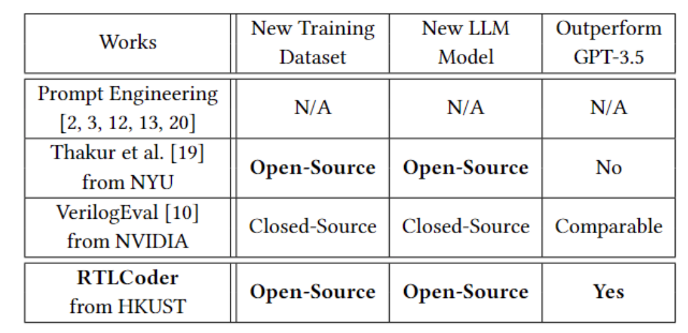

# RTL-Coder: Outperforming GPT-3.5 in RTL Code Generation with Our Fully Open-Source Dataset and Lightweight Solution
Shang Liu, Wenji Fang, Yao Lu, Qijun Zhang, Hongce Zhang, and Zhiyao Xie, "RTL-Coder: Outperforming GPT-3.5 in RTL Code Generation with Our Fully Open-Source Dataset and Lightweight Solution"[[paper]](https://arxiv.org/abs/2312.08617)

_**Note**: This repo is under construction. The training scripts and data generation flow are coming soon. We are also still actively further improving and validating RTLCoder. This is version V1.0. If you are interested, please kindly monitor our latest update on Arxiv and Github repo in the near future._

TABLE 1 summarizes existing works in LLM-based design RTL generation.

TABLE 1: LLM-based works on automatic design RTL (e.g., Verilog) generation based on natural language instructions. 

**In our work, we provide two RTL code generation models that are available on the HuggingFace platform.**
1. [RTLCoder-Z-v1.0](https://huggingface.co/ishorn5/RTLCoder-Z-v1.0).
2. [RTLCoder-Z-GPTQ4bit-v1.0](https://huggingface.co/ishorn5/RTLCoder-Z-GPTQ4bit-v1.0). 
