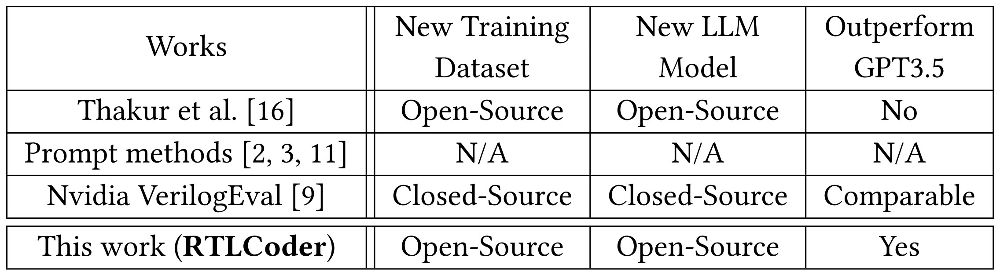
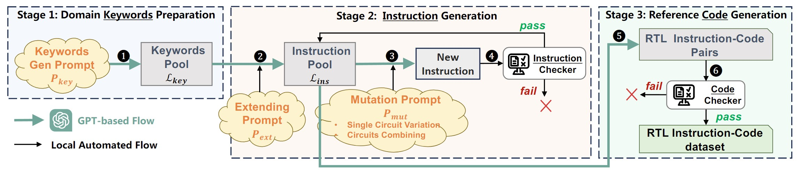
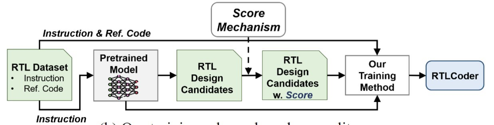

```
  ___    _____   _        ____               _               
 |  _ \  |_   _| | |      / ___|   ___     __| |   ___   _ __ 
 | |_) |   | |   | |     | |      / _ \   / _` |  / _ \ | '__|
 |  _ <    | |   | |___  | |___  | (_) | | (_| | |  __/ | |   
 |_| \_\   |_|   |_____|  \____|  \___/   \__,_|  \___| |_|                                           
```
# RTL-Coder: Outperforming GPT-3.5 in RTL Code Generation with Our Fully Open-Source Dataset and Lightweight Solution
Shang Liu, Wenji Fang, Yao Lu, Qijun Zhang, Hongce Zhang, and Zhiyao Xie, "RTL-Coder: Outperforming GPT-3.5 in RTL Code Generation with Our Fully Open-Source Dataset and Lightweight Solution"[[paper]](https://arxiv.org/abs/2312.08617)

_**Note**: This repo is under construction. The model, inference scripts, data generation flow and training flow  are provided. The whole dataset is coming soon. We are also still actively further improving and validating RTLCoder. This is version V1.0. If you are interested, please kindly monitor our latest update on Arxiv and Github repo in the near future.__

Targeting Verilog code generation, we propose an automated flow to generate a large labeled dataset with over 10,000 diverse Verilog design problems and answers. It addresses the serious data availability challenge in IC design-related tasks, and its potential applications are not limited to LLMs. The
LLM directly trained on it can already achieve comparable accuracy with GPT-3.5.

We also introduce a new LLM training scheme based on code quality feedback. It further boosts the ultimate model performance to outperform GPT-3.5. And we further revised the training process from an algorithm perspective to reduce its GPU memory consumption.


TABLE 1 summarizes existing works in LLM-based design RTL generation.



TABLE 1: LLM-based works on design RTL generation (e.g., Verilog). 

**In our work, we provide two RTL code generation models that are available on the HuggingFace platform.**
1. [RTLCoder-Z-v1.0](https://huggingface.co/ishorn5/RTLCoder-Z-v1.0).
2. [RTLCoder-Z-GPTQ4bit-v1.0](https://huggingface.co/ishorn5/RTLCoder-Z-GPTQ4bit-v1.0). 

## 1. Working flow overview
In this paper, there are two main contributions to obtain the RTLCoder. 
(1) We first introduce our automated dataset generation flow. It generated our RTL generation dataset with over 10 thousand samples, each sample being a pair of design description instruction and corresponding reference code. We build this automated generation flow by taking full advantage
of the powerful general text generation ability of the commercial tool GPT. Please notice that GPT is only used for dataset generation in this work and we adhere to the terms of service of OpenAI, and there is no commercial competition between the proposed RTLcoder and OpenAI's models. The automated dataset generation flow is illustrated in **Figure 1** which includes three stages: 1) RTL domain keywords preparation, 2) instruction generation, and 3) reference code generation. We designed several general prompt templates to control GPT generating the desired outputs in each stage.


   

   Figure 1:  Our proposed automated dataset generation flow.

(2) Besides the new training dataset, we propose a new LLM training scheme that incorporates code quality scoring. It significantly improves the RTLCoder’s performance on the RTL generation task. Also, we revised the training process from the algorithm perspective to reduce the GPU memory consumption of this new training method, allowing implementation with limited hardware resources. The training scheme is illustrated in **Figure 2**.


   

   Figure 2:  Our proposed training scheme based on RTL quality score.


## 2. Training data generation
We provide the generation scripts and data samples in the folder **"data_generation"**. You can design your own prompting method by modifying the file **"p_example.txt"** and **"instruction_gen.py"**.

You can expand the existing dataset by running the following command.
```
python instruction_gen.py
```
We provide a dataset demo with 10 samples in **"data_sample.json"** right now and the whole dataset will be released in the next few weeks.
Please kindly note that the dataset was generated by GPT-3.5-turbo and it cannot be guaranteed that all the data are strictly correct. Despite the possible presence of errors in some problem descriptions and design code, we believe that they can still provide valuable information for model training.

## 3. Model inference

(1) Inference demo

For inference using RTLCoder, you can just use the following code.
```
import torch
from transformers import AutoTokenizer, AutoModelForCausalLM
# Prompt
prompt = "Please act as a professional verilog designer and provide a half adder"

# Load model and tokenizer
# With multiple gpus, you can specify the GPU you want to use as gpu_name (e.g. int(0)).
tokenizer = AutoTokenizer.from_pretrained("ishorn5/RTLCoder-Z-v1.0")
model = AutoModelForCausalLM.from_pretrained("ishorn5/RTLCoder-Z-v1.0", torch_dtype=torch.float16, device_map=gpu_name)

# Sample
input_ids = tokenizer(prompt, return_tensors="pt").input_ids.to(gpu_name)
sample = model.generate(input_ids, max_length=512, temperature=0.5, top_p=0.9)
print(tokenizer.decode(sample[0], truncate_before_pattern=[r"endmodule"]) + "endmodule")
```
To test the RTLCoder-4bit-GPTQ,  you can just use the following code.
```
from transformers import AutoTokenizer
from auto_gptq import AutoGPTQForCausalLM, BaseQuantizeConfig
# Prompt
prompt = "Please act as a professional verilog designer and provide a half adder"

tokenizer = AutoTokenizer.from_pretrained("ishorn5/RTLCoder-Z-v1.0", use_fast=True)
model = AutoGPTQForCausalLM.from_quantized("ishorn5/RTLCoder-Z-GPTQ4bit-v1.0", device="cuda:0")
# Sample
input_ids = tokenizer(prompt, return_tensors="pt").input_ids.to(0)
sample = model.generate(input_ids, max_length=512, temperature=0.5, top_p=0.9)
print(tokenizer.decode(sample[0], truncate_before_pattern=[r"endmodule"]) + "endmodule")
```

(2) Test model on Verilog-eval

We provide the inference script **"test_on_verilog-eval.py"** for "verilog-eval" benchmark in folder **"benchmark_inference"**. 
You need to firstly download the "verilog-eval" benchmark.
```
git clone https://github.com/NVlabs/verilog-eval.git
```
Then modify the **"descri_path"** and **"input_path"** in **"test_on_nvbench.py"** according to the location of verlog-eval file.  

Use the following command to do model inference on EvalMachine.
```
python test_on_nvbench.py --model <your model path or "ishorn5/RTLCoder-Z-v1.0"> --n 20 --temperature=0.2 --gpu_name 0 --output_dir <your result directory> --output_file <your result file, e.g. rtlcoder_temp0.2_evalmachine.json> --bench_type Machine
```
If you want to do model inference on EvalHuman, just change the --bench_type from Machine to Human.
```
python test_on_nvbench.py --model <your model path or "ishorn5/RTLCoder-Z-v1.0"> --n 20 --temperature=0.2 --gpu_name 0 --output_dir <your result directory> --output_file <your result file, e.g. rtlcoder_temp0.2_evalhuman.json> --bench_type Human
```
Please refer the verilog-eval benchmark repo https://github.com/NVlabs/verilog-eval to evaluate the generated code quality.

(3) Test model on RTLLM

We provide the organized  descriptions of RTLLM as **"rtllm.json"**  in folder **"benchmark_inference"**. 

Use the following command to do inference on RTLLM benchmark.
```
python test_on_rtllm.py --model <your model path or "ishorn5/RTLCoder-Z-v1.0">  --n 5 --temperature=0.5 --gpu_name 0 --output_dir <your result directory> 
```
Please refer the RTLLM benchmark repo https://github.com/hkust-zhiyao/RTLLM to evaluate the generated code quality.

## 4. Model training
We provide three options for instruction tuning: MLE based direct train, Scoring train and Scoring train with gradients splitting. For more details, please refer to the paper and the folder **"train"**.

For MLE based direct training, just simply use:
```
torchrun --nproc_per_node=4  mle.py \
    --model_name_or_path <model path> \
    --data_path <data path> \
    --fp16 True \
    --output_dir <output path>\
    --num_train_epochs 3 \
    --per_device_train_batch_size 2 \
    --per_device_eval_batch_size 2 \
    --gradient_accumulation_steps 32 \
    --evaluation_strategy "no" \
    --save_strategy "steps" \
    --save_steps 50 \
    --save_total_limit 10 \
    --learning_rate 1e-5 \
    --weight_decay 0. \
    --logging_steps 1 \
    --tf32 False\
    --gradient_checkpointing True \
    --deepspeed ds_stage_2.json\
    --model_max_length 2048
```
For scoring based training method, you need to firstly obtain answer candidates to each of the instruction in the training dataset and we provide a data sample **"scoring_data_sample.json"** to illustrate the  data format for training.
Then use the following command.

```
torchrun --nproc_per_node=4  mle_scoring.py \
    --model_name_or_path <model path> \
    --data_path <data path> \
    --fp16 True \
    --output_dir <output path>\
    --num_train_epochs 3 \
    --per_device_train_batch_size 1 \
    --per_device_eval_batch_size 2 \
    --gradient_accumulation_steps 64\
    --evaluation_strategy "no" \
    --save_strategy "steps" \
    --save_steps 50 \
    --save_total_limit 10 \
    --learning_rate 1e-5 \
    --weight_decay 0. \
    --logging_steps 1 \
    --tf32 False\
    --gradient_checkpointing True \
    --deepspeed ds_stage_2.json\
    --model_max_length 2048
```

If your gpu could't afford batch size 1 with these answer candidates, try the gradients splitting method.
```
torchrun --nproc_per_node=4  mle_scoring_grad_split.py \
    --model_name_or_path <model path> \
    --data_path <data path> \
    --fp16 True \
    --output_dir <output path>\
    --num_train_epochs 3 \
    --per_device_train_batch_size 1 \
    --per_device_eval_batch_size 2 \
    --gradient_accumulation_steps 64\
    --evaluation_strategy "no" \
    --save_strategy "steps" \
    --save_steps 50 \
    --save_total_limit 10 \
    --learning_rate 1e-5 \
    --weight_decay 0. \
    --logging_steps 1 \
    --tf32 False\
    --gradient_checkpointing True \
    --deepspeed ds_stage_2.json\
    --model_max_length 2048
```

